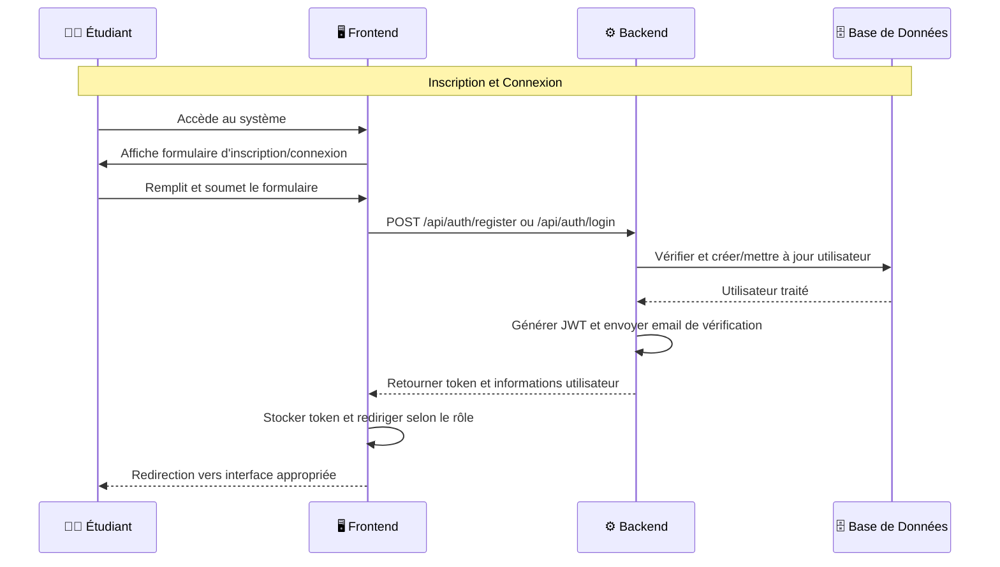
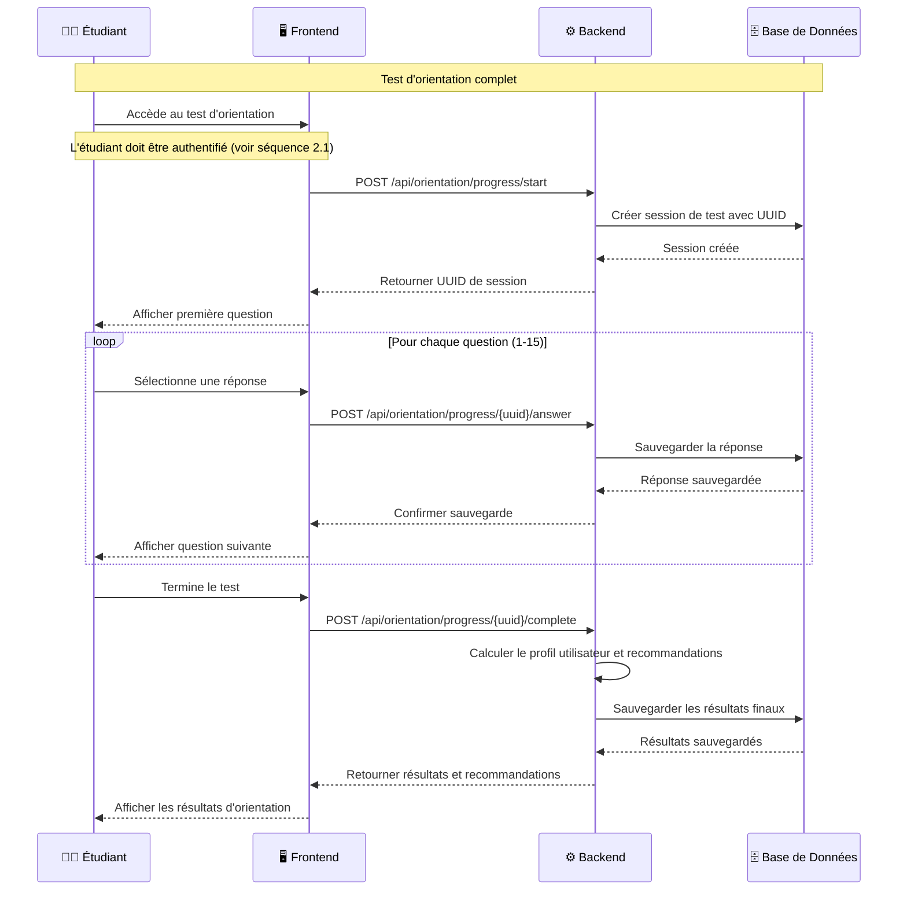
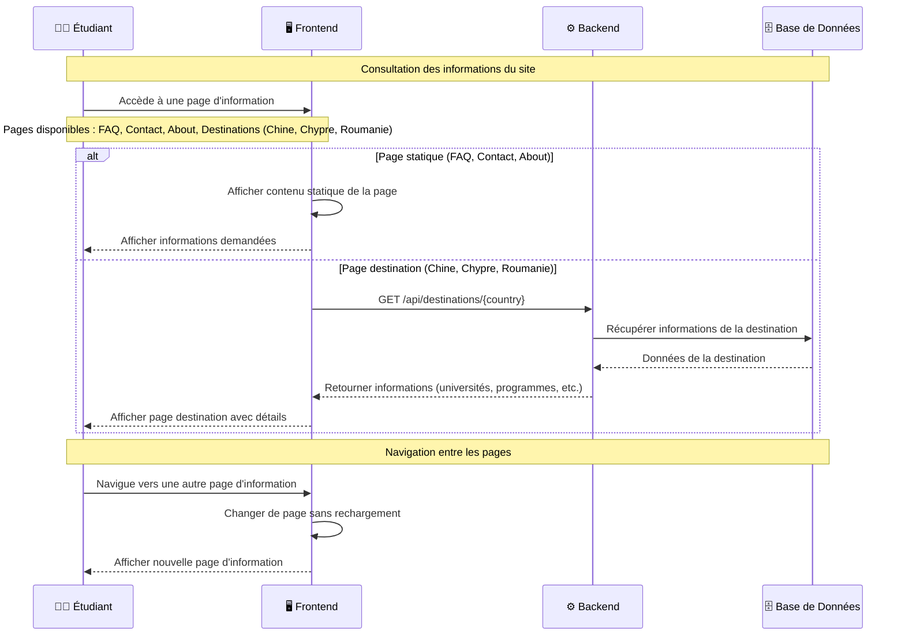

# Diagrammes du Système DIRAVENIR

## Analyse du Projet

Après analyse complète du projet frontend et backend, voici les diagrammes de cas d'usage et de séquence pour le système DIRAVENIR, **sans le rôle de conseiller** comme demandé.

### Acteurs Identifiés

1. **👨‍🎓 Étudiant** - Utilisateur principal du système
2. **👨‍💼 Administrateur** - Gestionnaire du système

### Entités Principales

- **Utilisateur** (classe de base)
- **Étudiant** (hérite de Utilisateur)
- **Administrateur** (entité séparée)
- **Application** (candidature complète)
- **Program** (programmes universitaires)
- **Candidature** (candidature simplifiée)
- **OrientationResult** (résultats d'orientation)
- **ChatSession** (sessions de chat)

---

## 1. Diagramme de Cas d'Usage Réel et Détaillé

```mermaid
graph TB
    %% Acteurs principaux
    E[👨‍🎓 Étudiant]
    A[👨‍💼 Administrateur]


analyse le


    C[👨‍🏫 Conseiller]
    
    %% Système principal
    SYS[📚 Système DIRAVENIR]
    
    %% === CAS D'USAGE ÉTUDIANT ===
    %% Authentification et profil
    E --> UC1[S'inscrire avec email et mot de passe]
    E --> UC2[Se connecter avec authentification JWT]
    E --> UC3[Vérifier son email]
    E --> UC4[Réinitialiser son mot de passe]
    E --> UC5[Gérer son profil utilisateur]
    
    %% Navigation et découverte
    E --> UC6[Consulter la page d'accueil]
    E --> UC7[Consulter les informations du site]
    E --> UC8[Consulter la FAQ]
    E --> UC9[Contacter le support]
    
    %% Test d'orientation
    E --> UC10[Accéder au test d'orientation]
    E --> UC11[Répondre aux 14 questions d'orientation]
    E --> UC12[Consulter ses résultats d'orientation]
    E --> UC13[Recevoir des recommandations de majeures]
    
    %% Gestion des programmes
    E --> UC14[Rechercher des programmes]
    E --> UC15[Filtrer les programmes par statut]
    E --> UC16[Consulter les détails d'un programme]
    E --> UC17[Sauvegarder des programmes favoris]
    E --> UC18[Postuler à un programme]
    
    %% Tableau de bord étudiant
    E --> UC19[Consulter son tableau de bord]
    E --> UC20[Suivre ses candidatures]
    E --> UC21[Consulter son calendrier]
    E --> UC22[Gérer ses programmes sauvegardés]
    E --> UC23[Consulter ses résultats de tests]
    
    %% Communication
    E --> UC24[Utiliser le chat en ligne]
    E --> UC25[Communiquer avec les conseillers]
    E --> UC26[Communiquer avec d'autres étudiants]
    
    %% Notifications et paramètres
    E --> UC27[Consulter ses notifications]
    E --> UC28[Configurer ses paramètres]
    E --> UC29[Changer de thème]
    E --> UC30[Changer de langue]
    
    %% === CAS D'USAGE ADMINISTRATEUR ===
    %% Gestion des utilisateurs
    A --> UC31[Gérer les comptes utilisateurs]
    A --> UC32[Activer/désactiver des comptes]
    A --> UC33[Consulter les profils utilisateurs]
    A --> UC34[Gérer les rôles utilisateurs]
    
    %% Gestion des programmes
    A --> UC35[Créer des programmes]
    A --> UC36[Modifier des programmes]
    A --> UC37[Supprimer des programmes]
    A --> UC38[Gérer les universités partenaires]
    A --> UC39[Gérer les destinations]
    
    %% Gestion des candidatures
    A --> UC40[Consulter toutes les candidatures]
    A --> UC41[Modifier le statut des candidatures]
    A --> UC42[Ajouter des notes administratives]
    A --> UC43[Consulter l'historique des statuts]
    
    %% Statistiques et rapports
    A --> UC44[Consulter les statistiques globales]
    A --> UC45[Générer des rapports]
    A --> UC46[Analyser les tendances]
    A --> UC47[Suivre les performances du système]
    
    %% === CAS D'USAGE CONSEILLER ===
    %% Support aux étudiants
    C --> UC48[Consulter les candidatures des étudiants]
    C --> UC49[Fournir des conseils personnalisés]
    C --> UC50[Communiquer via le chat]
    C --> UC51[Suivre le progrès des étudiants]
    
    %% === RELATIONS INCLUDE ===
    %% Authentification requise pour la plupart des cas d'usage
    UC10 --> UC2
    UC11 --> UC2
    UC12 --> UC2
    UC13 --> UC2
    UC14 --> UC2
    UC15 --> UC2
    UC16 --> UC2
    UC17 --> UC2
    UC18 --> UC2
    UC19 --> UC2
    UC20 --> UC2
    UC21 --> UC2
    UC22 --> UC2
    UC23 --> UC2
    UC24 --> UC2
    UC25 --> UC2
    UC26 --> UC2
    UC27 --> UC2
    UC28 --> UC2
    UC29 --> UC2
    UC30 --> UC2
    UC31 --> UC2
    UC32 --> UC2
    UC33 --> UC2
    UC34 --> UC2
    UC35 --> UC2
    UC36 --> UC2
    UC37 --> UC2
    UC38 --> UC2
    UC39 --> UC2
    UC40 --> UC2
    UC41 --> UC2
    UC42 --> UC2
    UC43 --> UC2
    UC44 --> UC2
    UC45 --> UC2
    UC46 --> UC2
    UC47 --> UC2
    UC48 --> UC2
    UC49 --> UC2
    UC50 --> UC2
    UC51 --> UC2
    
    %% === RELATIONS EXTEND ===
    %% Le test d'orientation étend la consultation des programmes
    UC11 -.-> UC14
    
    %% === RELATIONS GENERALIZATION ===
    %% Les cas d'usage de gestion sont des généralisations
    UC31 -.-> UC32
    UC31 -.-> UC33
    UC31 -.-> UC34
    
    UC35 -.-> UC36
    UC35 -.-> UC37
    
    UC40 -.-> UC41
    UC40 -.-> UC42
    UC40 -.-> UC43
    
    %% Styling
    classDef actor fill:#e1f5fe,stroke:#01579b,stroke-width:2px
    classDef usecase fill:#f3e5f5,stroke:#4a148c,stroke-width:2px
    classDef system fill:#e8f5e8,stroke:#1b5e20,stroke-width:3px
```

### Description du Diagramme de Cas d'Usage Réel

Ce diagramme représente l'architecture complète des cas d'usage du système DIRAVENIR basée sur l'analyse du code source réel. Il inclut **51 cas d'usage** répartis entre **3 acteurs principaux** :

#### 🎯 **Acteurs Identifiés**
- **👨‍🎓 Étudiant** : Utilisateur principal du système
- **👨‍💼 Administrateur** : Gestionnaire du système avec droits complets
- **👨‍🏫 Conseiller** : Intermédiaire entre étudiants et administration

#### 📋 **Cas d'Usage Étudiant (UC1-UC30)**

**Authentification et Profil :**
- UC1-UC5 : Inscription, connexion JWT, vérification email, réinitialisation mot de passe, gestion profil

**Navigation et Découverte :**
- UC6-UC9 : Page d'accueil, informations site, FAQ, support

**Test d'Orientation :**
- UC10-UC13 : Accès test, 14 questions, résultats, recommandations majeures

**Gestion des Programmes :**
- UC14-UC18 : Recherche, filtrage, détails, favoris, candidatures

**Tableau de Bord :**
- UC19-UC23 : Dashboard, suivi candidatures, calendrier, programmes sauvegardés, résultats tests

**Communication :**
- UC24-UC26 : Chat en ligne, communication conseillers et étudiants

**Paramètres :**
- UC27-UC30 : Notifications, paramètres, thème, langue

#### 🔧 **Cas d'Usage Administrateur (UC31-UC47)**

**Gestion Utilisateurs :**
- UC31-UC34 : Comptes, activation/désactivation, profils, rôles

**Gestion Programmes :**
- UC35-UC39 : CRUD programmes, universités partenaires, destinations

**Gestion Candidatures :**
- UC40-UC43 : Consultation, modification statuts, notes, historique

**Statistiques :**
- UC44-UC47 : Statistiques globales, rapports, tendances, performances

#### 👨‍🏫 **Cas d'Usage Conseiller (UC48-UC51)**

**Support Étudiants :**
- UC48-UC51 : Consultation candidatures, conseils personnalisés, chat, suivi progrès

#### 🔗 **Relations Identifiées**

**Relations Include :**
- Tous les cas d'usage (sauf navigation publique) incluent l'authentification JWT (UC2)

**Relations Extend :**
- Le test d'orientation (UC11) étend la recherche de programmes (UC14)

**Relations Generalization :**
- Les cas de gestion sont des généralisations de leurs sous-fonctionnalités

#### 🎨 **Fonctionnalités Techniques Réelles**

Ce diagramme reflète les fonctionnalités **réellement implémentées** dans le code :
- ✅ Authentification JWT avec Spring Security
- ✅ Test d'orientation avec 14 questions
- ✅ Système de candidatures avec statuts
- ✅ Chat en temps réel
- ✅ Tableau de bord personnalisé
- ✅ Gestion multi-rôles (ETUDIANT, CONSEILLER, ADMIN)
- ✅ Système de notifications
- ✅ Thèmes clair/sombre
- ✅ Support multilingue

---

## 2. Diagrammes de Séquence Utilisateur

### 2.1 Authentification Utilisateur



### 2.2 Test d'Orientation Utilisateur



### 2.3 Consultation d'Informations Utilisateur




---

## 3. Architecture du Système

### 3.1 Architecture Générale

```mermaid
graph TB
    subgraph "Frontend (React)"
        UI[🖥️ Interface Utilisateur]
        COMP[🧩 Composants React]
        SERV[🔧 Services API]
        CONTEXT[📱 Contextes (Auth, Theme)]
    end
    
    subgraph "Backend (Spring Boot)"
        CTRL[🎮 Contrôleurs REST]
        SERV_B[⚙️ Services Métier]
        REPO[🗃️ Repositories JPA]
        SEC[🔒 Sécurité JWT]
    end
    
    subgraph "Base de Données"
        DB[(🗄️ MySQL)]
    end
    
    subgraph "Services Externes"
        EMAIL[📧 Service Email]
        PAY[💳 Système Paiement]
        OAUTH[🔐 OAuth2 Google]
    end
    
    UI --> SERV
    SERV --> CTRL
    CTRL --> SERV_B
    SERV_B --> REPO
    REPO --> DB
    
    SERV_B --> EMAIL
    SERV_B --> PAY
    SERV_B --> OAUTH
    
    classDef frontend fill:#e3f2fd,stroke:#1976d2
    classDef backend fill:#f3e5f5,stroke:#7b1fa2
    classDef database fill:#e8f5e8,stroke:#388e3c
    classDef external fill:#fff3e0,stroke:#f57c00
    
    class UI,COMP,SERV,CONTEXT frontend
    class CTRL,SERV_B,REPO,SEC backend
    class DB database
    class EMAIL,PAY,OAUTH external
```

---

## 4. Résumé des Fonctionnalités Principales

### Pour les Étudiants :
- 🔐 **Inscription et connexion** (local + OAuth2 Google)
- 🧭 **Test d'orientation** personnalisé avec recommandations
- 🔍 **Recherche de programmes** universitaires
- 📝 **Candidature complète** avec paiement intégré
- 👤 **Gestion du profil** et suivi des candidatures
- 💬 **Chat en temps réel** pour le support
- ℹ️ **Consultation d'informations** (FAQ, Contact, About, Destinations)

### Pour les Administrateurs :
- 👥 **Gestion des utilisateurs** (création, modification, suppression)
- 🎓 **Gestion des programmes** et destinations universitaires
- 📋 **Gestion des candidatures** (approbation, rejet, suivi)
- 📊 **Statistiques et rapports** du système

### Architecture Technique :
- 🏗️ **Backend Spring Boot** avec API REST
- 🔒 **Sécurité JWT** et authentification OAuth2
- 💾 **Base de données MySQL** avec JPA/Hibernate
- 🌐 **Frontend React** avec gestion d'état
- 🔌 **WebSocket** pour le chat temps réel
- 📧 **Notifications email** automatiques

---

**Note importante** : Le rôle de conseiller a été supprimé de cette analyse comme demandé. Le système fonctionne maintenant avec deux acteurs principaux : les étudiants et les administrateurs.
